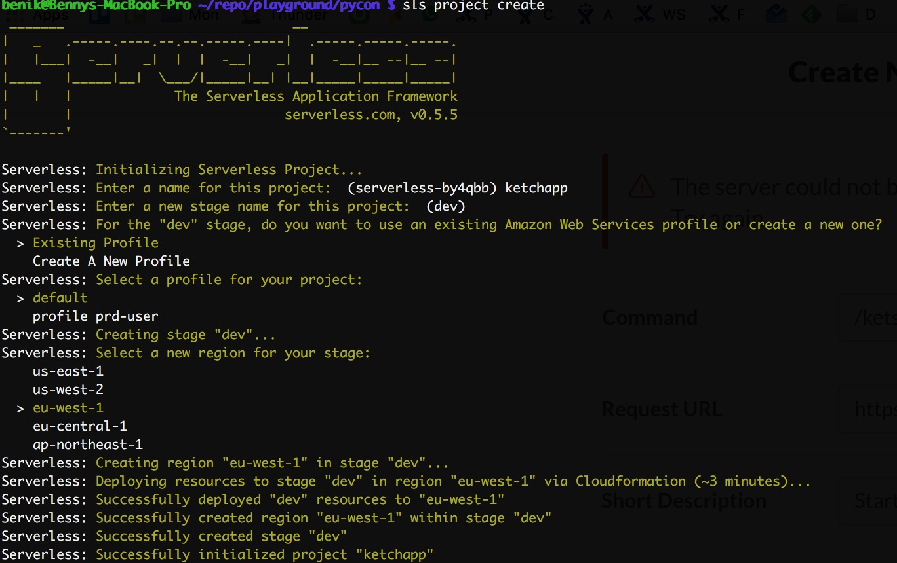
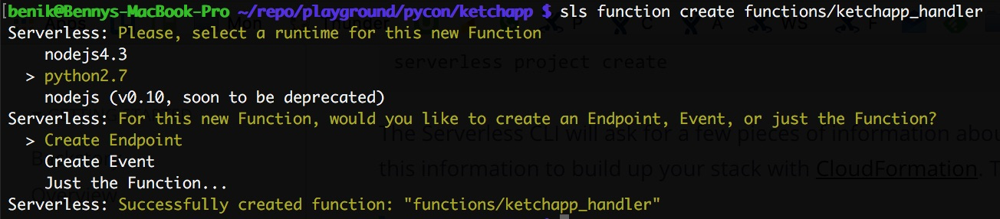
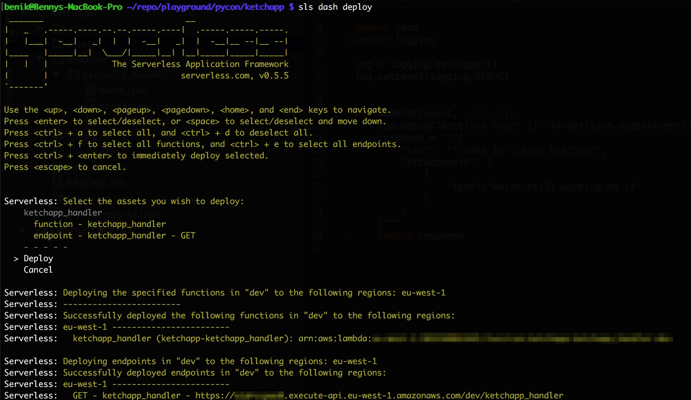

# Ketchapp 
Your [Pomodoro](http://pomodorotechnique.com/) mentor! 


Ketchapp helps your focus to catch up with your work.

<a href="https://slack.com/oauth/authorize?scope=incoming-webhook,commands&client_id=2778138625.38014984439"></a>

## Development
Install Node.js

	brew install node

Install Serverless

	npm install -g serverless
	
Create serverless project
	
	sls project create
	


Create serverless function
	
	sls function create functions/ketchapp_handler


Implement it and deploy

	sls dash deploy



## Usage
Install Node.js

	brew install node

Install Serverless

	npm install -g serverless

Clone this repository

	git clone https://git.autodesk.com/bauerb/monitor-test

Add .env file to root folder:

```
SERVERLESS_STAGE=dev
SERVERLESS_DATA_MODEL_STAGE=dev
SERVERLESS_PROJECT_NAME=monitor-test
```

Add admin.env file to root folder (get staging credentials from 1Password):

```
SERVERLESS_ADMIN_AWS_ACCESS_KEY_ID=
SERVERLESS_ADMIN_AWS_SECRET_ACCESS_KEY=
```


Create the dependencies packages:

```
cd functions
pip install -t vendored/ -r requirements.txt
```

Deploy it!

	sls dash deploy


*Ketcup icon was made by freepik from [www.flaticon.com](http://www.flaticon.com/free-icon/ketchup-bottle_34603)*
