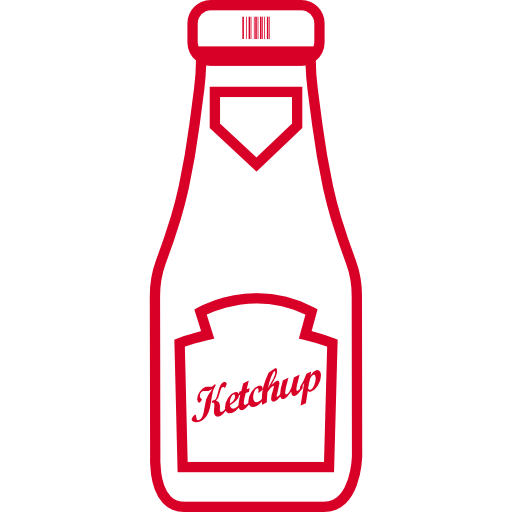

# Ketchapp 
Your [Pomodoro](http://pomodorotechnique.com/) mentor! 


Ketchapp helps your focus to catch up with your work.

<a href="https://slack.com/oauth/authorize?scope=incoming-webhook,commands&client_id=2778138625.38014984439"></a>

## Development
Install Node.js

	brew install node

Install Serverless

	npm install -g serverless
	
Create serverless project
	
	sls project create
	


Create serverless function
	
	sls function create functions/ketchapp_handler


Implement it and deploy

	sls dash deploy


## Usage
Install Node.js

	brew install node

Install Serverless

	npm install -g serverless

Clone this repository

	git clone https://github.com/bennybauer/Ketchapp.git
	

Add admin.env file to root folder:

```
AWS_DEV_PROFILE=<your aws profile>
```

Add `s-variables-common.json` file to `_meta/variables` folder:

```
{
  "project": "ketchapp",
  "slackVerificationToken": "<your_verification_token>",
  "slackClientId": "<your_client_id>",
  "slackClientSecret": "<your_secret>",
  "slackClientRedirectUri": "</oauth lambda url>"
}
```


Create the dependencies packages:

```
cd functions
pip install -t vendored/ -r requirements.txt
```

Deploy it!

	sls dash deploy


*Ketcup icon was made by freepik from [www.flaticon.com](http://www.flaticon.com/free-icon/ketchup-bottle_34603)*
